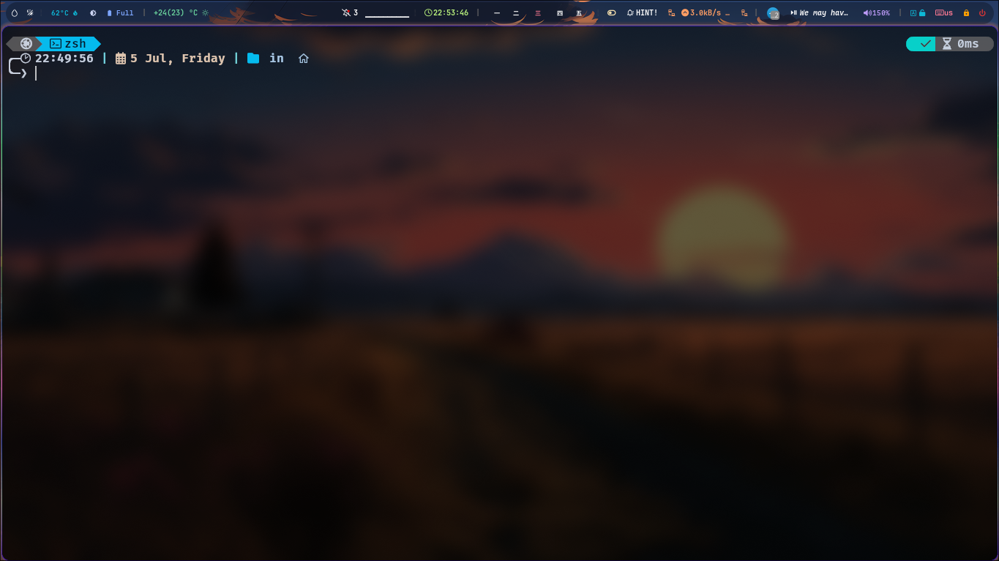

# CustomTerminal-ohmyposh
> This installation guide is for Linux. If you're unsure about your operating system, please leave a comment.

## 🚀 How to Install Oh My Posh

### Step 1: Install .NET SDK
Oh My Posh is built on .NET, so you need to install the .NET SDK first.

```bash
sudo apt update
sudo apt install -y dotnet-sdk-6.0
```

### Step 2: Download and Install Oh My Posh
```bash
sudo wget https://github.com/JanDeDobbeleer/oh-my-posh/releases/latest/download/posh-linux-amd64 -O /usr/local/bin/oh-my-posh
sudo chmod +x /usr/local/bin/oh-my-posh
```

### Step 3: Configure Your Shell with Oh My Posh
#### For Bash:
```bash
echo 'eval "$(oh-my-posh init bash)"' >> ~/.bashrc
source ~/.bashrc
```

#### For Zsh:
```bash
echo 'eval "$(oh-my-posh init zsh)"' >> ~/.zshrc
source ~/.zshrc
```

### Step 4: Create a Configuration Directory for Oh My Posh
```bash
mkdir -p ~/.config/ohmyposh
cd ~/.config/ohmyposh
```

### Step 5: Import the Base Configuration
```bash
oh-my-posh config export --output ./base.json
```

### Step 6: Edit Your Shell Configuration
Open your favorite text editor, such as Neovim, and edit the configuration line added in step 3.

```bash
nvim ~/.zshrc
```

Change the line to:

```bash
eval "$(oh-my-posh init zsh --config $HOME/.config/ohmyposh/base.json)"
```

Save and exit the editor by pressing `Esc` and then typing `:wq`.

## 🎨 How to Choose a Theme for Your Terminal

When you open your terminal, you will be greeted with a new terminal theme.



To change the theme, follow these steps:

1. Visit the [Oh My Posh Themes](https://ohmyposh.dev/docs/themes) page and select a theme you like.
2. Click on the theme's name to go to its GitHub page.
3. Copy the JSON text of your chosen theme.
4. Open the configuration file:

    ```bash
    nvim ~/.config/ohmyposh/base.json
    ```

5. Replace all the text in `base.json` with the JSON text you copied.
6. Apply the new theme:

    ```bash
    source ~/.zshrc
    ```

Enjoy your newly themed terminal! 🎉
```

This `README.md` file now includes emojis for better readability and engagement, corrected grammar, and a structured format for easy following.